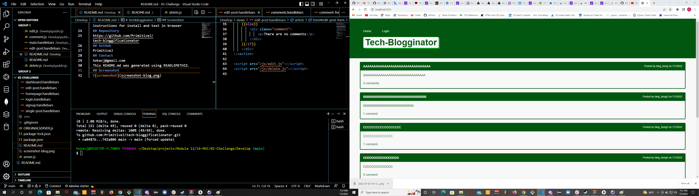

# Techblogginator
  ## Badge
  
  ## Description 
  A simple tech blog application using MVC modularization with Sequelize, MYsql, Express, Node, and Handlebars. 
  ## Table of contents
  - [Installation](#Installation)
  - [Usage](#Usage)
  - [License](#License)
  - [Contributions](#Contributions)
  - [Testing](#Testing)
  - [Repository Link](#Repository)
  - [GitHub Info](#GitHub) 
  ## Installation
  download package.json, run npm i, run script npm run start and check in browser
  ## Usage
  Use to develop a simple blog or just to test MVC functionality
  ## License
  
  ## Contributions
  Christopher Hoke AKA James Primitive
  ## Testing
  Test by using deployed application or follow instructions for install and test in browser
  ## Repository
  https://github.com/PrimitiveJ/tech-bloggificationator
  ## GitHub
  PrimitiveJ
  ## Contact
  hokecj@gmail.com
  This README.md was generated using READLEMETHIS.
  ## Screenshot
  